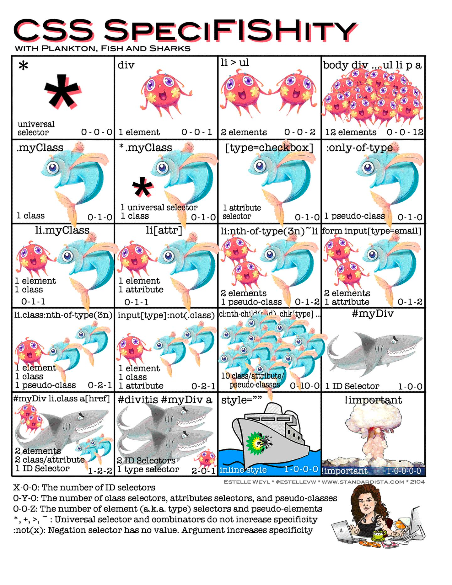

# CSS 优先级及权重

优先级就是分配给指定的 CSS 声明的一个权重，它由匹配的选择器中的每一种选择器类型的数值决定。

## 1. 选择器权重

| 选择器                | 例子               | 权重值    |
| --------------------- | ------------------ | --------- |
| `!important` 关键字   | `!important`       | 1-0-0-0-0 |
| 行内样式              | style              | 0-1-0-0-0 |
| ID                    | #id                | 0-0-1-0-0 |
| 属性选择器/class/伪类 | .class             | 0-0-0-1-0 |
| 元素名/伪元素         | span               | 0-0-0-0-1 |
| 其它                  | `*`、`·`、`>`、`~` | 0-0-0-0-0 |

```css
/* 选择器权重 = 0-0-1-2-1 */
div.test .class #id {
  color: yellow;
}
```



## 2. 优先级是如何计算

- 权重不同的样式规则作用于同一元素时，权重高的规则生效；

- 权重相同的样式规则作用于同一元素时，后声明的规则生效；

- 选择器在 DOM 中的位置关系不会对规则产生影响；

- 否定伪类（`:not()`）比较特殊，它不会对权重产生影响，但是否定伪类内部的选择器会影响权重；

- 再多的标签选择器组合也没有一个类选择器优先级高，其他类似计算也是如此。
