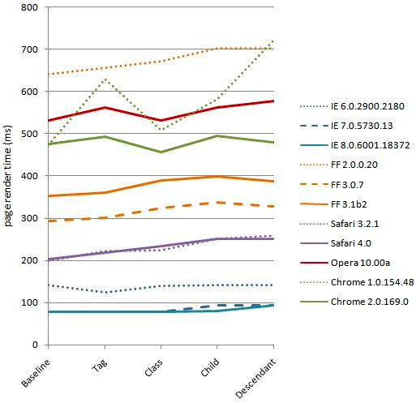

# CSS 选择器性能

效率低下的 CSS 选择器会降低页面渲染速度，CSS 规则的某些类型以及与 JavaScript 的交互可能会使页面变慢。 复杂的页面（子选择器和子代选择器）通常表现最差。

如下图是 12 个浏览器对 CSS 规则的性能测试：



不过在大多数情况下，CSS 对性能的影响很小，对 CSS 选择器的改进只会带来几十毫秒的提升。

## 1. 选择器的效率

选择器效率从高到低排序如下：

| 等级 | 选择器       | 用法              |
| ---- | ------------ | ----------------- |
| 1    | Id 选择器    | #myId             |
| 2    | 类选择器     | .myClass          |
| 3    | 标签选择器   | div               |
| 4    | 相邻选择器   | h1 + p            |
| 5    | 子选择器     | ul > li           |
| 6    | 后代选择器   | li a              |
| 7    | 通配符选择器 | \*                |
| 8    | 属性符选择器 | a[rel='external'] |
| 9    | 伪类符选择器 | a:hover           |

ID 选择器和类选择器在速度上的差异很小很小，在重绘速度上，ID 选择器要比类选择器慢一点点（0.2ms 的差异）。

## 2. 选择器使用原则

- 使用最合理优先级的选择器；

- 极少情况下使用 ID 选择器，最常用的是类选择器；

- li、td、dd 等大量连续出现时，并且样式相同，采用后代选择器；

- 避免使用内联样式，即在标签中写入 CSS，违背了内容与显示分离的思想，并且很难覆盖其样式。

## 3. `!important` 使用原则

- 优先考虑使用样式规则的优先级来解决问题而不是 `!important`

- 只有在需要覆盖全站或外部 CSS 的特定页面中使用 `!important`

- 永远不要在你的插件中使用 `!important`

- 永远不要在全站范围的 CSS 代码中使用 `!important`

- 覆盖内联样式时或者优先级很高的选择器，可以考虑使用 `!important`

## 4. 如何提升 CSS 选择器的性能？

### 4.1 避免使用通用选择器

```css
.content {
  color: red;
}
```

浏览器匹配文档中所有的元素后，分别向上逐级匹配 class 为 content 的元素，直到文档的根节点。因此匹配开销很大，所以避免使用关联选择器是通配选择器的情况。

### 4.2 避免使用标签或 class 选择器限制 ID 选择器

ID 选择器是唯一的，加上限制条件，反而增加了不必要的匹配。

```css
/* 避免使用 */
button#backButton {
}

/* 推荐使用 */
#backButton {
}

/* 避免使用 */
.menu-left#backButton {
}

/* 推荐使用 */
#backButton {
}
```

### 4.3 避免使用标签限制 class 属性

```css
/* 避免使用 */
button.backButton {
}

/* 推荐使用 */
.backButton {
}
```

### 4.4 避免使用多层标签选择器，使用 class 选择器替换多层级，减少 css 查找

```css
/* 避免使用 */
treeitem[mailfolder='true'] > treerow > treecell {
}

/* 推荐使用 */
.treecell-mailfolder {
}
```

### 4.5 避免使用子选择器

```css
/* 避免使用 */
treehead treerow treecell {
}

treehead > treerow > treecell {
}

/* 推荐使用 */
.treecell-header {
}
```

### 4.6 使用继承

CSS 具有高效的继承性
