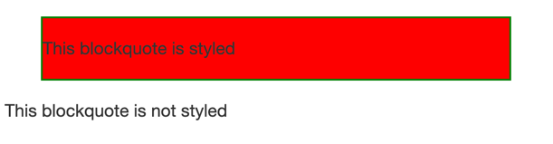

# CSS 继承

CSS 中，每个 CSS 属性都定义了该属性默认是否继承。对于继承属性，如果没有指定值，则会获取父元素同属性的值。对于非继承属性，如果没有指定默认值，则取该属性的初始值。

## 控制继承

CSS 为控制继承提供了四个特殊的通用属性值。每个 css 属性都可以设置这些值。

### 1. `inherit`

设置该属性会使子元素属性和父元素相同，即继承父元素的值。对于非继承属性，该值无意义。

```css
/* 设置二级标题的颜色为绿色 */
h2 {
  color: green;
}

#sidebar h2 {
  color: inherit;
}
```

### 2. `initial`

设置属性值和浏览器默认样式相同。如果浏览器默认样式中未设置且该属性是自然继承的，那么会设置为 `inherit` 。

`initial` 可用于将所有 CSS 属性恢复到其初始状态。

### 3. `unset`

将属性重置为自然值，也就是如果属性是自然继承那么就是 `inherit`，否则和 `initial` 一样。

### 4. `revert`

该属性浏览器的多数版本还不支持。

如果属性从其父级继承，则将其重置为继承的值，或者重置为由用户代理的样式表（或如果存在的话，由用户样式）建立的默认值。

`revert` 与 `unset` 许多情况完全相同。唯一的区别是属性具有由浏览器或用户创建的自定义样式表设置的值。

## 重设所有属性值

CSS 的 `all` 属性可以用于同时将选择器所有的继承值重新设置。

```html
<blockquote>
  <p>This blockquote is styled</p>
</blockquote>

<blockquote class="fix-this">
  <p>This blockquote is not styled</p>
</blockquote>
```

```css
blockquote {
  background-color: red;
  border: 2px solid green;
}

.fix-this {
  all: unset;
}
```


