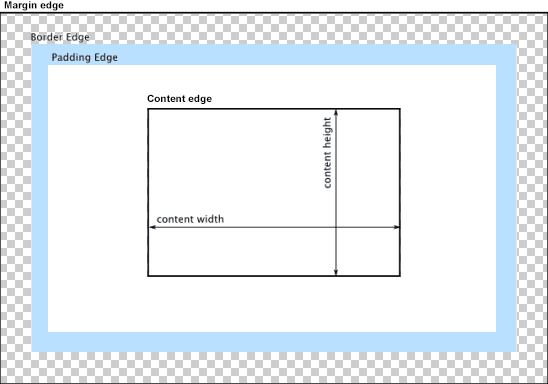
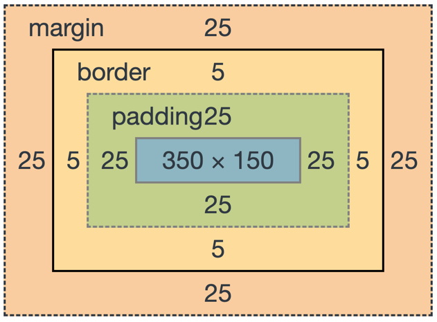
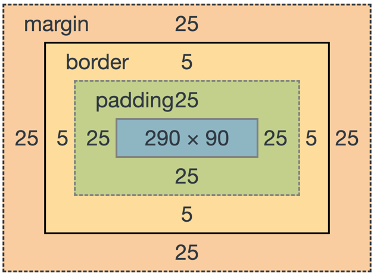

# CSS 盒子模型

CSS 盒子模型将所有的元素表示为一个矩形的盒子，模型定义了盒的每个部分：

- Content box: 这个区域是用来显示内容，大小可以通过设置 width 和 height；

- Padding box: 包围在内容区域外部的空白区域； 大小通过 padding 相关属性设置；

- Border box: 边框盒包裹内容和内边距。大小通过 border 相关属性设置；

- Margin box: 这是最外面的区域，是盒子和其他元素之间的空白区域。大小通过 margin 相关属性设置。



CSS 盒子模型分为 IE 盒模型和 W3C 标准盒模型。

> 浏览器中使用哪个盒模型可以由 box-sizing（CSS 新增的属性）控制，默认值为 content-box，即标准盒模型；
>
> 如果将 box-sizing 设为 border-box 则用的是 IE 盒模型。

## W3C 标准盒模型

在标准模型中，如果你给盒设置 width 和 height，实际设置的是 content box。

即属性 width，height 只包含内容 content，不包含 border 和 padding。

```css
.box {
  width: 350px;
  height: 150px;
  margin: 25px;
  padding: 25px;
  border: 5px solid black;
}
```

标准模型宽度 = 350px + 25px + 25px + 5px + 5px = 410px；

标准模型高度 = 150px + 25px + 25px + 5px + 5px = 210px。



## IE 盒模型

在 IE 模型中，属性 width，height 包含 border 和 padding，指的是 content + padding + border。

```css
.box {
  width: 350px;
  height: 150px;
  margin: 25px;
  padding: 25px;
  border: 5px solid black;
}
```

IE 盒模型宽度 = width = 350px；

IE 盒模型高度 = width = 150px。



> 注: margin 不计入实际大小 —— 当然，它会影响盒子在页面所占空间，但是影响的是盒子外部空间。
>
> 盒子的范围到边框为止 —— 不会延伸到 margin。
