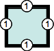
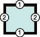
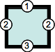
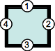
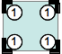
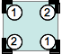
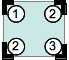
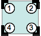

# CSS 简写属性（shorthand property）

简写属性是可以同时设置好几个 CSS 属性值的 CSS 属性。这样可以使编写更简洁、更有可读性。

## 1. 简写属性注意情况

### 1.1 没有指定的值会被设置为初始值

如下样式，`background-color` 的颜色不会生效，而是会被设置为默认值 `transparent`，这是因为第二条规则优先级高。

```css
.class {
  background-color: red;
  background: url(images/bg.gif) no-repeat top right;
}
```

### 1.2 `inherit` 只可应用于单独属性，不可用于简写属性

## 2. 简写属性

### 2.1 `border`、`margin`、`padding` 属性

此三个属性都遵循以下的规则：

| 图例 | 说明 |
| --- | --- |
|  | 1 个值的语法：border-width: 1em — 这一个值表示所有的边框宽度 |
|  | 2 个值的语法：border-width: 1em 2em — 第一个值表示垂直方向的，即 top 和 bottom；第二个值表示水平方向的，即 left 和 right |
|  | 3 个值的语法：border-width: 1em 2em 3em — 第一个值表示 top；第二个值表示水平方向的，即 left 和 right； 第三个值表示 bottom |
|  | 4 个值的语法：border-width: 1em 2em 3em 4em — 这四个值分别表示 top、right、bottom、left，TRBL 顺时针。 |

### 2.2 `border-radius` 属性

| 图例 | 说明 |
| --- | --- |
|  | 1 个值的语法：border-radius: 1em — 这一个值表示所有的表框角度的半径 |
|  | 2 个值的语法：border-radius: 1em 2em — 第一个值表示 top-left 和 bottom-right 方向的角；第二个值表示 top-right 和 bottom-left 方向的角 |
|  | 3 个值的语法：border-radius: 1em 2em 3em — 第一个值表示 top-left 方向的角 ，第二个值表示 top-right 和 bottom-left 方向的角，第三个值表示 bottom-right 方向的角 |
|  | 4 个值的语法：border-radius: 1em 2em 3em 4em — 这四个值分别表示 top-left、 top-right、 bottom-right 、bottom-left 方向的角。总是按此顺序，即从 top-left 开始的顺时针顺序 |

### 2.2 `background` 属性

`background` 有以下属性：

```css
background-color: #000;
background-image: url(images/bg.gif);
background-repeat: no-repeat;
background-position: top right;
```

可以简写成一行声明：

```css
background: #000 url(images/bg.gif) no-repeat top right;
```

### 2.3 `font` 属性

`font` 有以下属性：

```css
font-style: italic;
font-weight: bold;
font-size: 0.8em;
line-height: 1.2;
font-family: Arial, sans-serif;
```

可以简写成一行声明：

```css
font: italic bold 0.8em/1.2 Arial, sans-serif;
```

### 2.4 `border` 属性

`border` 属性的宽度、类型、颜色可以被简写到一个属性里

```css
border-width: 1px;
border-style: solid;
border-color: #000;
```

可以被简写为

```css
border: 1px solid #000;
```

### 2.5 `border` 属性

## 3. 通用简写属性

CSS 提供了一个通用的简写属性 `all`，它可以应用于文档里的除 `unicode-bidi`, `direction` 及自定义属性外的所有属性设置为初始值或者继承值。
