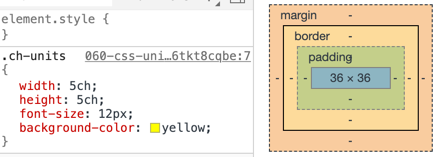

# CSS 单位

## 1. 长度（length）单位

长度单位主要分为两种，相对和绝对。

- **相对长度单位** 基于其它元素的长度。例如 em 基于该元素的字号大小，vh 则与设备视口的高度有关。

- **绝对长度单位** 则是一个固定的物理长度。

### 1.1 `ch` 单位

相对单位，该单位代表 0 的宽度。即 `1ch` 就是 1 个 0 的宽度（非高度）。

也就是说 `2ch` 宽度的容器，只能装下两个 0。

```html
<div class="ch-units">00000000</div>
```

```css
.ch-units {
  width: 5ch;
  height: 5ch;
  font-size: 12px;
  background-color: yellow;
}
```

因为 `ch` 是相对宽度，并且是根据 0 的宽度变化而变化，所以改变 0 的字体大小，`ch` 的宽度也会发生变化。

如下图右侧是 `12px` 的字体大小，`5ch` 宽度是 `36px`



如下图右侧是 `14px` 的字体大小，`5ch` 宽度是 `42px`


`ch` 还有如下规则：

> 1ch = 1 个英文 = 1 个数字 2ch = 1 个中文

### 1.2 `ex` 单位

相对单位，该单位表示小写字母 "x" 的高度，即 `1ex` 就是 1 个 "x" 的高度。

通常来说，`1ex ≈ 0.5em`

```html
<div class="ex-units">xxxxxxxx</div>
```

```css
.ex-units {
  width: 5ex;
  height: 5ex;
  font-size: 12px;
  background-color: blue;
}
```

### 1.3 `em` 单位

相对单位，`em` 单位最多可以设置三位小数。

- 元素的字体大小设置 `em` 是相对于父元素的字体大小，即父元素 `16px`，子元素的字体大小 `2em = 2 * 16px = 32px`

- 元素的 `width` `height` `padding` `marigin` 以 `em` 为单位，则是相对于该元素的 `font-size`，即如果元素的字体大小是 `12px`，则 `width = 2em = 2 * 12px = 24px`（元素如果未设置字体大小，则继承父元素字体大小）。

```html
<div class="em-units">emmmmmmm</div>
```

```css
.em-units {
  width: 5em;
  height: 5em;
  font-size: 2em;
  background-color: pink;
}
```


如上所示，`div` 的字体大小计算结果是 `32px`，Chrome 浏览器默认字体大小是 `16px`，所以其父元素默认是 `16px`，所以该元素的字体大小 `2em = 16px * 2 = 32px`，然后宽高是以当前元素的字体大小计算的，前面得出当前元素的字体大小计算为 `32px`，所以宽高 `5em` 就是 `32px * 5 = 160px`。

### 1.4 `rem` 单位

相对单位，`1 rem` 与等于根元素(`<html>`) `font-size` 的计算值。

即 `<html>` 节点的字体大小 `font-size: 16px`，则 `1rem = 16px`，以此类推。

### 1.5 `vh`、`vw`、`vmin`、`vmax` 视口单位（Viewport units）

在桌面端，视口指的是浏览器的可视区域；在移动端，指的视布局视口（Layout Viewport）。

- `vw` : 1vw 等于视口宽度的 1%，也即视口的宽度可以用 100vw 表示

- `vh` : 1vh 等于视口高度的 1%，，也即视口的高度可以用 100vh 表示

- `vmin` : 选取 vw 和 vh 中最小的那个

- `vmax` : 选取 vw 和 vh 中最大的那个

假设浏览器的视口尺寸宽度为 1080px，那么 1vw = 1080px \* 1% = 108px。
